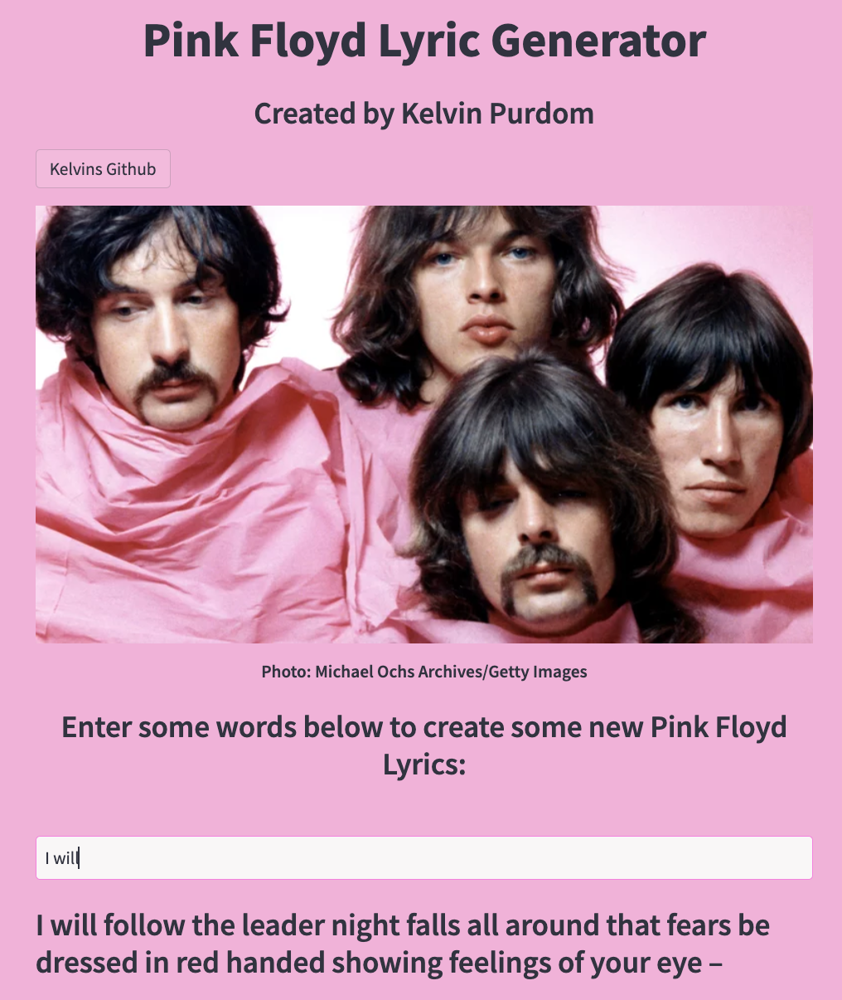

# Pink Floyd Lyric Generator


#### Dataset: https://www.kaggle.com/datasets/joaorobson/pink-floyd-lyrics

#### Streamlit app: https://pinkfloydlyricgenerator.streamlit.app/

## Introduction
I have created a project that uses a LSTM model, to generate new and interesting suggestions for lyrics by letting the user input a seed text(or starting lyrics), then using the Pink Floyd Lyric database to suggest potential words to follow the seed text.

## Installing Dependencies
The initial setup.

Create virtualenv and install the project:
```bash
sudo apt-get install virtualenv python-pip python-dev
deactivate; virtualenv ~/venv ; source ~/venv/bin/activate ;\
    pip install pip -U; pip install -r requirements.txt
```

Unittest test:
```bash
make clean install test
```

Check for PinkFloydLyricGenerator in gitlab.com/{group}.
If your project is not set please add it:

- Create a new project on `gitlab.com/{group}/PinkFloydLyricGenerator`
- Then populate it:

```bash
##   e.g. if group is "{group}" and project_name is "MushroomPrediction"
git remote add origin git@github.com:{group}/PinkFloydLyricGenerator.git
git push -u origin master
git push -u origin --tags
```

## Screenshot of App

